# 🪔 Diwali Sales Analysis using Python

An end-to-end Exploratory Data Analysis (EDA) project on the **Diwali Sales Dataset** using Python. This project explores customer purchasing behavior during the Diwali festival, identifies sales trends, and generates business insights through data cleaning, analysis, and visualization.

---

# 📌 Project Overview

The primary objective of this project is to analyze customer purchasing patterns and identify the factors influencing sales during the Diwali season. By performing data cleaning, exploratory data analysis, and visualization, meaningful insights were generated that can help businesses better understand their customers and make data-driven decisions.

---

# 🛠️ Technologies Used

- Python
- Pandas
- NumPy
- Matplotlib
- Seaborn
- Jupyter Notebook

---

# 📂 Dataset Information

The dataset contains customer purchase records including:

- Customer ID
- Gender
- Age
- Age Group
- Marital Status
- State
- Occupation
- Product Category
- Product ID
- Purchase Amount
- Orders

---

# 📋 Project Workflow

## Data Loading

- Imported the dataset into Pandas
- Explored the dataset structure
- Examined data types and summary statistics

## Data Cleaning

- Removed unnecessary columns
- Handled missing values
- Removed duplicate records
- Corrected data types
- Prepared the dataset for analysis

## Exploratory Data Analysis

The project includes analysis on:

- Customer Gender Distribution
- Revenue by Gender
- Age Group Distribution
- Revenue by Age Group
- State-wise Orders
- State-wise Revenue
- Marital Status Analysis
- Occupation Analysis
- Product Category Analysis
- Top Selling Products

---

# 📊 Project Preview

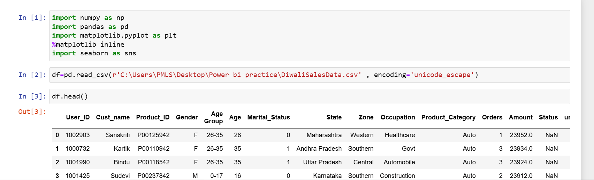

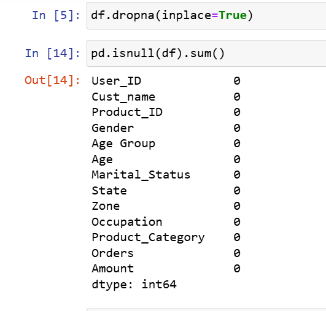

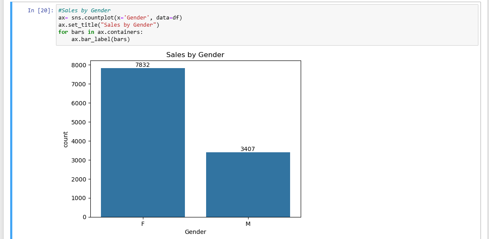

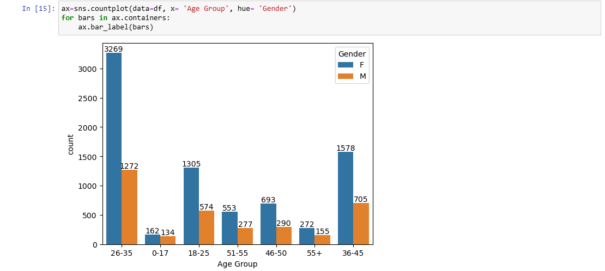

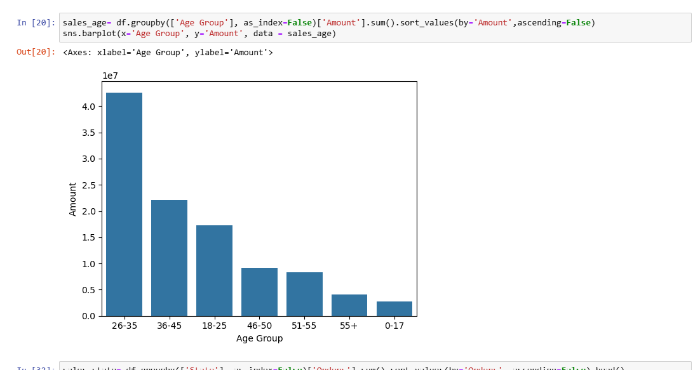

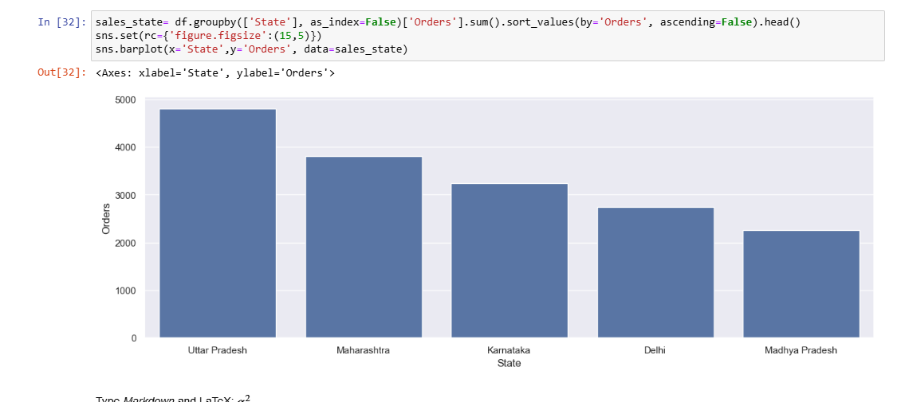

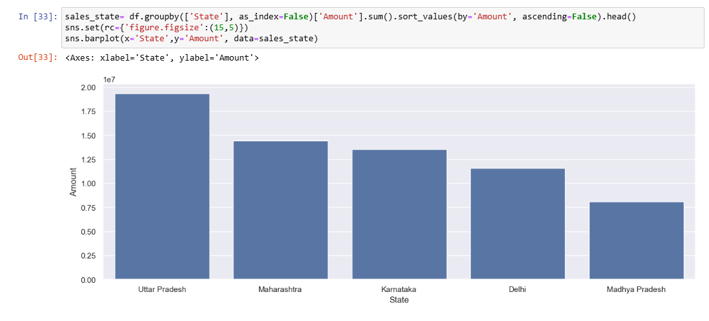

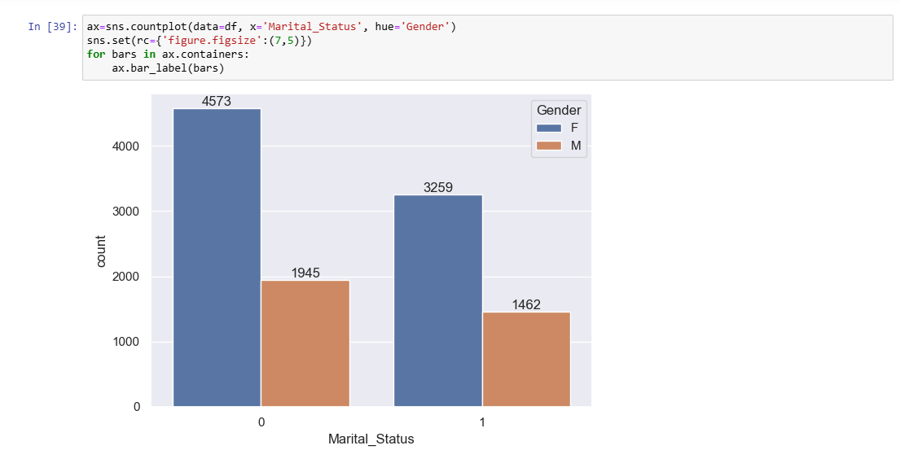

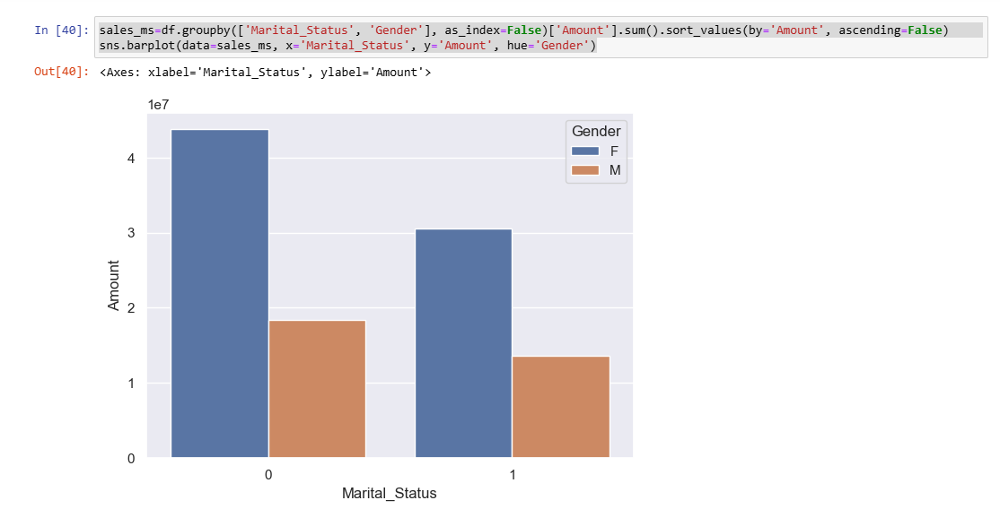

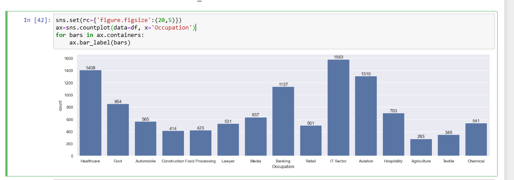

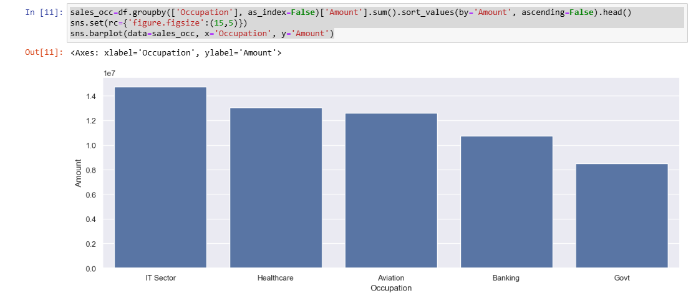

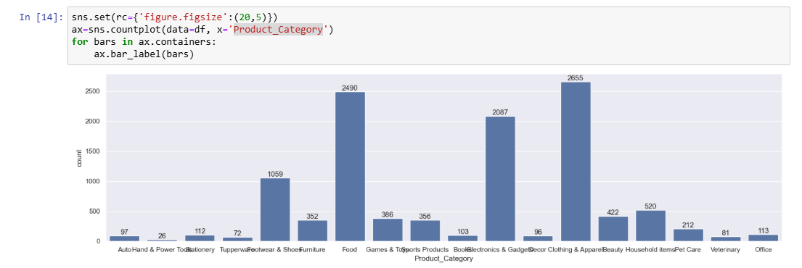

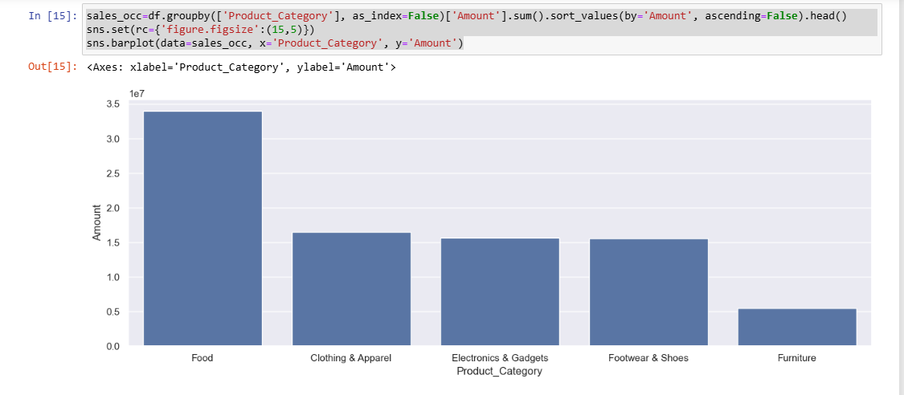

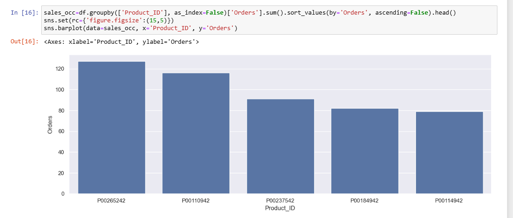

---

# 📈 Key Insights

- Female customers generated significantly higher revenue than male customers.
- Customers aged **26–35 years** were the most active buyers.
- Married women represented one of the strongest purchasing segments.
- Customers working in the **IT**, **Healthcare**, and **Aviation** sectors showed higher purchasing power.
- Clothing, Food, and Electronics were among the most popular product categories.
- A few states contributed a major share of the total revenue, highlighting strong regional demand.
- Customer demographics played an important role in purchasing behavior during the Diwali season.

---

# 💡 Business Value

This analysis can help businesses:

- Identify high-value customer segments.
- Design targeted marketing campaigns.
- Improve customer segmentation.
- Optimize product inventory.
- Focus on high-performing product categories.
- Develop region-specific sales strategies.
- Improve customer engagement during festive seasons.

---

# 🎯 Skills Demonstrated

- Data Cleaning
- Data Wrangling
- Exploratory Data Analysis (EDA)
- Data Visualization
- Business Insight Generation
- Statistical Analysis
- Python Programming
- Pandas
- NumPy
- Matplotlib
- Seaborn

---

# 📁 Repository Structure

```text
Diwali-Sales-Analysis/
│
├── Sales Analysis with Python.ipynb
├── DiwaliSalesData.csv
├── README.md
└── screenshotsp1/
    ├── 1.png
    ├── 2.png
    ├── 3.png
    ├── ...
    └── 14.png
```

---

# 🚀 Future Improvements

- Build an interactive Power BI dashboard using the same dataset.
- Perform customer segmentation using clustering techniques.
- Develop sales forecasting models using machine learning.
- Create an interactive dashboard using Streamlit.
- Deploy the project as a web application.

---

# 👨‍💻 Author

**Syed Sami Ullah**

- **GitHub:** https://github.com/SyedSamiUllah1
- **LinkedIn:** www.linkedin.com/in/syed-sami-ullah-9232602a6


---

⭐ **If you found this project useful, consider giving it a Star!**
